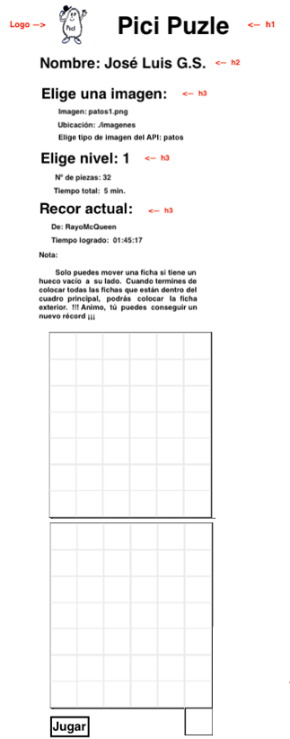
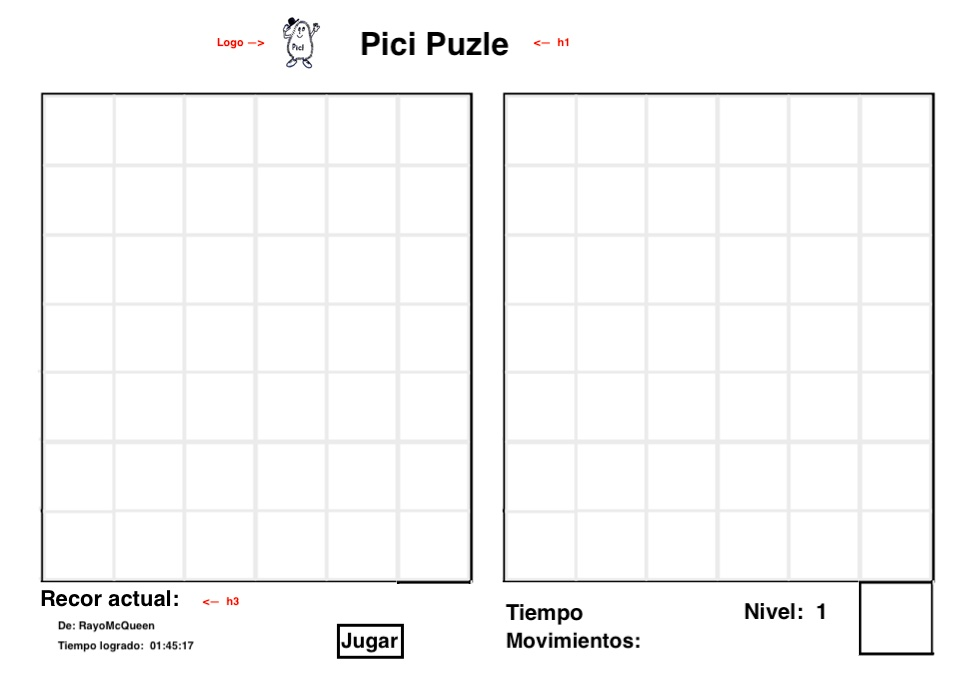
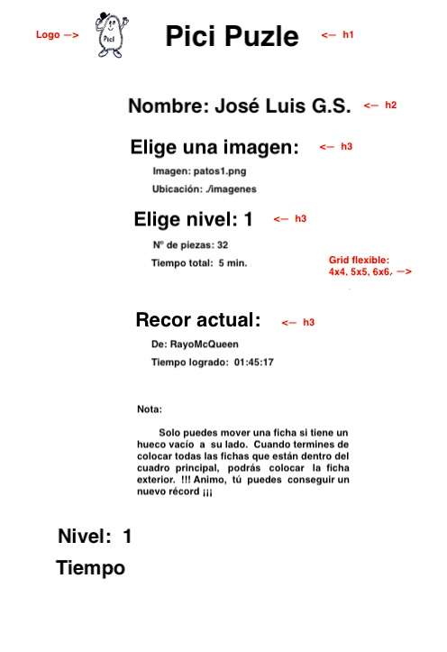
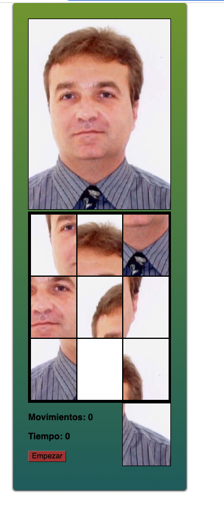

# Proyecto para final de curso de GA. ---> 

## ¿Porque se creó?

La idea principal es conseguir lograr un sitio de juegos multiples o juegos reunidos para que el cansado y estresado se relaje con pequeños juegos para ejercitar su mente.

Es decir este sería el boceto principal o uno de los bocetos para incrementar en un futuro no muy lejano, en el que pienso estar.

## Metodologia

El programa esta basado y elaborado utilizando el sistema grid, flex, canvas para obtener la flexibilidad necesaria y ser lo más responsiva y versátil posible para adaptarse a los datos e imágenes que pueda aportar el cliente.

## Bocetos de inicio del proyeco

Esta era la idea inicial.

Este fue el primer Boceto conseguido:

## Responsivo

Este apartado aun esta en desarrollo.

## Moviles:

Este apartado aun esta en desarrollo.

## Dificultades:

La mayor dificultad del programa fué el sistema canvas que ha cambiado mucho en estos ultimos años y la informacion que existe en la red es muy poco clara, por lo que tuve que hacer mil pruebas por mi cuenta. Es por eso por lo que la maquetacion y algunos otros detalles estan descuidados.

Pero sin embargo puedo decir que con respecto al manejo de canvas. !!!!! Reto superado !!!!!

## Acceso al proyecto:

https://github.com/picigui/ProyectoJLGS02
https://moonlit-travesseiro-3513cc.netlify.app/
